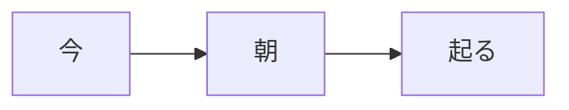

# Translation Case Study

## Prompt
Recently, I wanted to translate the sentence **"It will already be morning when I wake up."** to Japanese, which has the following temporal relationship.

I started with
> 私が起きる時、もう朝です。

and, with the help of a native speaker, arrived at

> 私が起きる時、朝になっています。

I thought this would be a perfect opportunity to analyze the nuance of 「もう」, 「～時」, 「～ている」, and 「なる」 versus 「です」.

## Translation 1
> 私が起きる時、もう朝です。
* I opted for 「が」 to emphasize that it was when *I* wake up versus someone else.
* I use 「起きる」 in the non-past tense to indicate that I wake up *after* the B clause occurs in the 「A時、B。」 grammar construction.
* I use 「もう」 to indicate "already."

#### The Problem
From a temporal standpoint, the original sentence is fairly complex, so using 「もう」 with 「です」 causes a bit of confusion.
The original sentence is talking about two events in the future, but emphasizing that one occurs after the other does.

* 「です」 by itself will be assumed to indicate in the current moment.
  * E.g., 「朝です。」 means "It *is* morning."
* Using 「でした」 would completely change the meaning of the sentence to past tense as the tense of the 「A時、B。」 grammar construction depends on the conjugation of the B clause.
  * I.e., Using「でした」 would mean that the sentence is referring to a past event.
* The 「～時」 clause causes listeners to be drawn to a certain moment in time, whereas the 「もう」 causes listeners to anticipate something that has already happened.

#### Observations
* 「です」 without a time clause is generally assumed to refer to the current moment even if it's being used to refer to a future event.
* 「もう」 is typically used with past-tense verbs to indicate "already" as in 「もう食べました。」 ("I already ate.").
  * 「もう」 *can* be used with non-past constructions to indicate already, but usually only with 「です」.
    * E.g., 「もう朝です。」 means "It *is* already morning," whereas 「もう朝でした。」 means "It *was* already morning."
    * E.g., 「もう三時です。」 means "It *is* already 3."
* 「～時」 realtively specifies when the two clauses occur in relation to each other.

#### Verdict
So overall, this translation does get the job done, but it is a little awkward with the literal translation is "When I wake up, it is already morning."

## Translation 2
> 私が起きる時、もう朝になる。
* Opted for 「なる」 over 「です」 to be more explicit that these are *future* events.

#### The Problem
* 「もう～なる」 is also a strange construction and translates to "will already become."

#### Observations
Since 「なる」 means "to become" and 「です」 means "to be," they can sometimes be used interchangeably.
* 「朝です」("It is morning.") ＝「朝になりました」(lit. "It became morning.") ＝「朝になっています」("It has become morning.")
* 「あさでした」("It was morning.") ＝「朝になっていました」(lit. "It had become morning.")

#### Verdict
This translation is explicitly referring to the future, but now sounds awkward using 「もう」.

## Translation 3
> 私が起きる時、もう朝になっています。

This and the next translation require a bit of interpretation.
* Using 「なっている」 in this case is not only being explicit about the future but also that there will be a *change* to morning by the time I wake up.

#### Observations
* The ～ている form of 「なる」 does not indicate "becoming" as it is one of those verbs that indicates a change in state. E.g., 「結婚しています」 for "am married."
* Using 「もう」 with 「なっている」 has the same effect as using it with 「です」.
  * E.g., 「もう朝です」("It is already morning.") ＝「もう朝になっている」("It has already become morning.")

#### Verdict
With this, the awkwardness of 「もう」 has been alleviated, *and* the sentence is explicitly referring to the future.

## Translation 4
> 私が起きる時、朝になっています。
* The 「もう」 can be dropped as 「なっている」 is already working to imply that there will have already been a change in state.

## Alternative Translation
> 私が起きる時、朝になる。
* Derived from [Translation 2](#translation-2), this sentence works and is explicit about the future, but lacks the effect added in by "already."

## Summary
* All of these translations do work, but 「です」 causes a bit of confusion since most people will assume you are referring to the current moment.
* So in short, the subsequent translations are focused on making it sound more natural.
* All of these translation rely on the 「～時」 clause to help determine their place in time.
